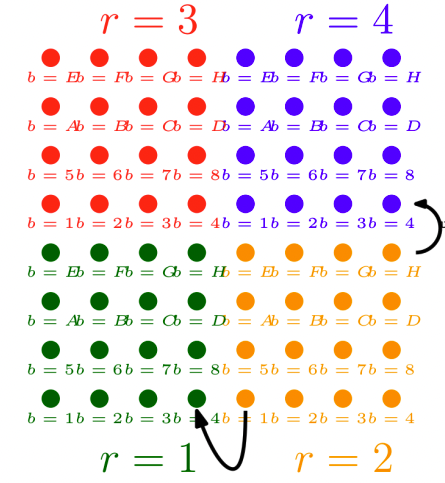

# Lattice.jl

This library provide a basic single-core implementation of basic structures for Lattice Field Theory.

## Spacetime
The basic implementation of spacetime geometry is defined in the `Geometry.jl` module. 

> Important: this structure has been completely copied by Alberto Ramos' [`LatticeGPU.jl`](https://igit.ific.uv.es/alramos/latticegpu.jl) to which minor changes has been applied.

A generic lattice site of coordinates $\vec n = (n_0, n_1, \ldots, n_{d-1})$ is mapped onto a 2-dimensional grid: The $D$-dimensional lattice volume is divided in subvolumes (each one denoted by its block index $r$), while a "fine" index $b$ runs lexico-graphically over all the points inside a subvolume.

$$(b,r) = \text{lattice point in D dimensions}$$

To illustrate the mapping we take the example of $D=2$:

> Figure taken from documentation of [`LatticeGPU.jl`](https://igit.ific.uv.es/alramos/latticegpu.jl)

To initialize the spacetime geometry structure one has to call the `Grid` struct by specifiying:
- the number of dimensions `D` as the implicit type of the structure
- a tuple with the lattice size in each dimension as an argument
- a tuple with the lattice block sizes in each dimension as an argument
  

General rules: the length of the tuples must be the same and must coincide with the number of dimensions. The lattice sizes must be divisible for the block sizes).

```
julia> space = Grid{2}((8,8),(4,4))
  Lattice dimensions:       2
  Lattice size:             8 x 8
  Time boundary conditions: PERIODIC
  Thread block size:        4 x 4     [16] (Number of blocks: [4])
  Twist tensor: (0,)
```

Given a point $(b,r)$ the neighbor points in the direction $\hat\mu$ can be found using the functions `up` and `dw`. As in the picture:

```
julia> dw((1,2),1,space)
  (4, 1)
```
or
```
julia> up((16,2),2,space)
  (4, 4)
```


In order to pass from a standard $D$-dimensional `CartesianIndex` coordinate to the 2d mapped index one can use `point_coord` or `point_index` functions
```
julia> point_coord((15,2),space)
  CartesianIndex(7, 4)

julia> point_index(CartesianIndex(7,4),space)
  (15, 2)
```

## Fields
Basic structure for fields are defined in the module `Fields.jl`.

`Field` structures are wrappers around a 3-dimensional arrays called `conf`. First and last index corresponds to $(b,r)$, while central index correspond to field degrees of freedom (a scalar field will have length 1 in its second index).

One can define a generic field feeding a `Grid`-typed object to `Field{T,D,N}`
- `T` is the type of variables (degrees of freedom). [E.g. for a scalar field `T=Float64`]. Custom types can be defined also
- `D` is the number of spacetime dimensions
- `N` is the number of `T` typed variable per spacetime points

The easiest example is a scalar field $\phi(x)$, which can be defined as
```
julia> ϕ = Field{Float64,2,1}(space)
julia> ϕ.conf
  16×1×4 Array{Float64, 3}:
  [:, :, 1] =
   2.6235267924e-314
   2.6185169035e-314
   2.617367114e-314
   2.62246282e-314
   2.602436695e-314
   2.603489727e-314
   2.6061366066e-314
   2.6024593037e-314
   2.60245909e-314
   2.602613634e-314
   2.672353055e-314
   2.6722868267e-314
   2.6722475623e-314
   2.672060023e-314
   2.393048157e-314
   2.3930474927e-314
    ...
```

The module fields define basic structure and functions. In particular:
- `heatup!` and `freeze!` fill a configuration with random numbers or ones (respectively). If `T` is a custom type, the function `Random.rand!` and `ones` must be overridden
- IO functions: `save!` and `read!` to save and load a configuration, respectively.